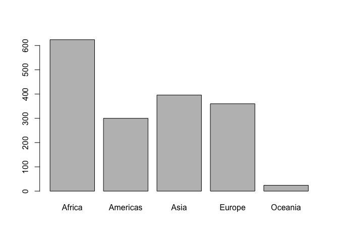

Something fascinating
================
Saurabh Mishra
2018-02-04

Pre-Requisite libraries: 1. gapminder 2. tidyverse

Working with the Gapminder dataset

``` r
library(gapminder)
library(tidyverse)

# Get an overview of the gapminder dataset
str(gapminder)
```

    ## Classes 'tbl_df', 'tbl' and 'data.frame':    1704 obs. of  6 variables:
    ##  $ country  : Factor w/ 142 levels "Afghanistan",..: 1 1 1 1 1 1 1 1 1 1 ...
    ##  $ continent: Factor w/ 5 levels "Africa","Americas",..: 3 3 3 3 3 3 3 3 3 3 ...
    ##  $ year     : int  1952 1957 1962 1967 1972 1977 1982 1987 1992 1997 ...
    ##  $ lifeExp  : num  28.8 30.3 32 34 36.1 ...
    ##  $ pop      : int  8425333 9240934 10267083 11537966 13079460 14880372 12881816 13867957 16317921 22227415 ...
    ##  $ gdpPercap: num  779 821 853 836 740 ...

``` r
# Type of objects in gapminder
class(gapminder)
```

    ## [1] "tbl_df"     "tbl"        "data.frame"

``` r
gapminder
```

    ## # A tibble: 1,704 x 6
    ##    country     continent  year lifeExp      pop gdpPercap
    ##    <fctr>      <fctr>    <int>   <dbl>    <int>     <dbl>
    ##  1 Afghanistan Asia       1952    28.8  8425333       779
    ##  2 Afghanistan Asia       1957    30.3  9240934       821
    ##  3 Afghanistan Asia       1962    32.0 10267083       853
    ##  4 Afghanistan Asia       1967    34.0 11537966       836
    ##  5 Afghanistan Asia       1972    36.1 13079460       740
    ##  6 Afghanistan Asia       1977    38.4 14880372       786
    ##  7 Afghanistan Asia       1982    39.9 12881816       978
    ##  8 Afghanistan Asia       1987    40.8 13867957       852
    ##  9 Afghanistan Asia       1992    41.7 16317921       649
    ## 10 Afghanistan Asia       1997    41.8 22227415       635
    ## # ... with 1,694 more rows

``` r
# Initial rows of dataset
head(gapminder)
```

    ## # A tibble: 6 x 6
    ##   country     continent  year lifeExp      pop gdpPercap
    ##   <fctr>      <fctr>    <int>   <dbl>    <int>     <dbl>
    ## 1 Afghanistan Asia       1952    28.8  8425333       779
    ## 2 Afghanistan Asia       1957    30.3  9240934       821
    ## 3 Afghanistan Asia       1962    32.0 10267083       853
    ## 4 Afghanistan Asia       1967    34.0 11537966       836
    ## 5 Afghanistan Asia       1972    36.1 13079460       740
    ## 6 Afghanistan Asia       1977    38.4 14880372       786

``` r
# Last rows of dataset
tail(gapminder)
```

    ## # A tibble: 6 x 6
    ##   country  continent  year lifeExp      pop gdpPercap
    ##   <fctr>   <fctr>    <int>   <dbl>    <int>     <dbl>
    ## 1 Zimbabwe Africa     1982    60.4  7636524       789
    ## 2 Zimbabwe Africa     1987    62.4  9216418       706
    ## 3 Zimbabwe Africa     1992    60.4 10704340       693
    ## 4 Zimbabwe Africa     1997    46.8 11404948       792
    ## 5 Zimbabwe Africa     2002    40.0 11926563       672
    ## 6 Zimbabwe Africa     2007    43.5 12311143       470

``` r
# Column names in dataset
names(gapminder)
```

    ## [1] "country"   "continent" "year"      "lifeExp"   "pop"       "gdpPercap"

``` r
# Number of rows
nrow(gapminder)
```

    ## [1] 1704

``` r
# Number of columns
ncol(gapminder)
```

    ## [1] 6

``` r
# Number of rows x columns
dim(gapminder)
```

    ## [1] 1704    6

``` r
# statistical overview
summary(gapminder)
```

    ##         country        continent        year         lifeExp     
    ##  Afghanistan:  12   Africa  :624   Min.   :1952   Min.   :23.60  
    ##  Albania    :  12   Americas:300   1st Qu.:1966   1st Qu.:48.20  
    ##  Algeria    :  12   Asia    :396   Median :1980   Median :60.71  
    ##  Angola     :  12   Europe  :360   Mean   :1980   Mean   :59.47  
    ##  Argentina  :  12   Oceania : 24   3rd Qu.:1993   3rd Qu.:70.85  
    ##  Australia  :  12                  Max.   :2007   Max.   :82.60  
    ##  (Other)    :1632                                                
    ##       pop              gdpPercap       
    ##  Min.   :6.001e+04   Min.   :   241.2  
    ##  1st Qu.:2.794e+06   1st Qu.:  1202.1  
    ##  Median :7.024e+06   Median :  3531.8  
    ##  Mean   :2.960e+07   Mean   :  7215.3  
    ##  3rd Qu.:1.959e+07   3rd Qu.:  9325.5  
    ##  Max.   :1.319e+09   Max.   :113523.1  
    ## 

``` r
# visualizing dataset
plot(lifeExp ~ year, gapminder)
```


``` r
plot(lifeExp ~ gdpPercap, gapminder)
```


``` r
plot(lifeExp ~ log(gdpPercap), gapminder)
```


Looking at Variables of Data Frame

``` r
library(gapminder)
library(tidyverse)

# life expectancy variable
head(gapminder$lifeExp)
```

    ## [1] 28.801 30.332 31.997 34.020 36.088 38.438

``` r
summary(gapminder$lifeExp)
```

    ##    Min. 1st Qu.  Median    Mean 3rd Qu.    Max. 
    ##   23.60   48.20   60.71   59.47   70.85   82.60

``` r
hist(gapminder$lifeExp)
```


``` r
# year variable
summary(gapminder$year)
```

    ##    Min. 1st Qu.  Median    Mean 3rd Qu.    Max. 
    ##    1952    1966    1980    1980    1993    2007

``` r
table(gapminder$year)
```

    ## 
    ## 1952 1957 1962 1967 1972 1977 1982 1987 1992 1997 2002 2007 
    ##  142  142  142  142  142  142  142  142  142  142  142  142

``` r
# continent variable
class(gapminder$continent)
```

    ## [1] "factor"

``` r
summary(gapminder$continent)
```

    ##   Africa Americas     Asia   Europe  Oceania 
    ##      624      300      396      360       24

``` r
levels(gapminder$continent)
```

    ## [1] "Africa"   "Americas" "Asia"     "Europe"   "Oceania"

``` r
nlevels(gapminder$continent)
```

    ## [1] 5

``` r
str(gapminder$continent)
```

    ##  Factor w/ 5 levels "Africa","Americas",..: 3 3 3 3 3 3 3 3 3 3 ...

``` r
table(gapminder$continent)
```

    ## 
    ##   Africa Americas     Asia   Europe  Oceania 
    ##      624      300      396      360       24

``` r
barplot(table(gapminder$continent))
```



``` r
library(gapminder)
library(tidyverse)

## we exploit the fact that ggplot2 was installed and loaded via the tidyverse
p <- ggplot(filter(gapminder, continent != "Oceania"),
            aes(x = gdpPercap, y = lifeExp)) # just initializes
p <- p + scale_x_log10() # log the x axis the right way
p + geom_point() # scatterplot
```


``` r
p + geom_point(aes(color = continent)) # map continent to color
```


``` r
p + geom_point(alpha = (1/3), size = 3) + geom_smooth(lwd = 3, se = FALSE)
```


``` r
p + geom_point(alpha = (1/3), size = 3) + facet_wrap(~ continent) +
  geom_smooth(lwd = 1.5, se = FALSE)
```


