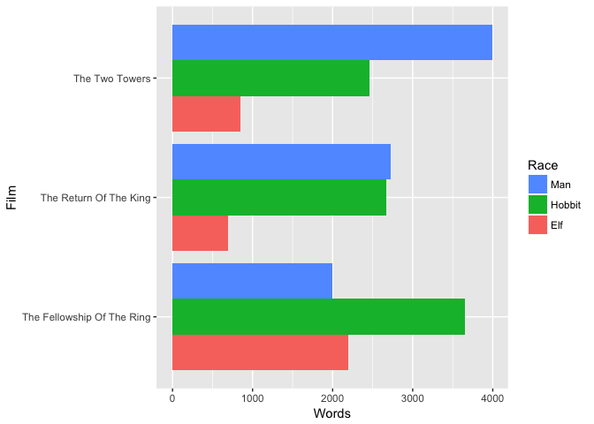

tidyr
================
Saurabh Mishra
2018-02-13

Benefits of Clean Data
----------------------

An important aspect of "writing data for computers" is to make your data **tidy**. Key features of **tidy** data:

-   Each column is a variable
-   Each row is an observation

``` r
library(tidyverse)
```

    ## ── Attaching packages ────────────────────────────────────────── tidyverse 1.2.1 ──

    ## ✔ ggplot2 2.2.1     ✔ purrr   0.2.4
    ## ✔ tibble  1.4.1     ✔ dplyr   0.7.4
    ## ✔ tidyr   0.7.2     ✔ stringr 1.2.0
    ## ✔ readr   1.1.1     ✔ forcats 0.2.0

    ## ── Conflicts ───────────────────────────────────────────── tidyverse_conflicts() ──
    ## ✖ dplyr::filter() masks stats::filter()
    ## ✖ dplyr::lag()    masks stats::lag()

``` r
# This data has been formatted for consumption by human eyeballs.

# The format makes it easy for a human to look up the numbers, but makes it pretty hard for a computer to pull out such counts and, more importantly, to compute on them or graph them.

(fship <- read.csv("data/The_Fellowship_Of_The_Ring.csv"))
```

    ##                         Film   Race Female Male
    ## 1 The Fellowship Of The Ring    Elf   1229  971
    ## 2 The Fellowship Of The Ring Hobbit     14 3644
    ## 3 The Fellowship Of The Ring    Man      0 1995

``` r
(rking <- read.csv("data/The_Return_Of_The_King.csv"))
```

    ##                     Film   Race Female Male
    ## 1 The Return Of The King    Elf    183  510
    ## 2 The Return Of The King Hobbit      2 2673
    ## 3 The Return Of The King    Man    268 2459

``` r
(ttow <- read.csv("data/The_Two_Towers.csv"))
```

    ##             Film   Race Female Male
    ## 1 The Two Towers    Elf    331  513
    ## 2 The Two Towers Hobbit      0 2463
    ## 3 The Two Towers    Man    401 3589

Tidy data is generally taller and narrower. It doesn't fit nicely on the page.

``` r
(lotr_tidy <- read.csv("data/lotr_tidy.csv"))
```

    ##                          Film   Race Gender Words
    ## 1  The Fellowship Of The Ring    Elf Female  1229
    ## 2  The Fellowship Of The Ring Hobbit Female    14
    ## 3  The Fellowship Of The Ring    Man Female     0
    ## 4              The Two Towers    Elf Female   331
    ## 5              The Two Towers Hobbit Female     0
    ## 6              The Two Towers    Man Female   401
    ## 7      The Return Of The King    Elf Female   183
    ## 8      The Return Of The King Hobbit Female     2
    ## 9      The Return Of The King    Man Female   268
    ## 10 The Fellowship Of The Ring    Elf   Male   971
    ## 11 The Fellowship Of The Ring Hobbit   Male  3644
    ## 12 The Fellowship Of The Ring    Man   Male  1995
    ## 13             The Two Towers    Elf   Male   513
    ## 14             The Two Towers Hobbit   Male  2463
    ## 15             The Two Towers    Man   Male  3589
    ## 16     The Return Of The King    Elf   Male   510
    ## 17     The Return Of The King Hobbit   Male  2673
    ## 18     The Return Of The King    Man   Male  2459

Certain elements get repeated alot, e.g. `Hobbit`. For these reasons, we often instinctively resist **tidy** data as inefficient or ugly.

But, unless and until you're making the final product for a textual presentation of data, ignore your yearning to see the data in a compact form.

Using `lotr_tidy`:-

-   What's the total number of words spoken by male hobbits?
-   Does a certain Race dominate a movie? Does the dominant Race differ across the movies?

``` r
# What's the total number of words spoken by *male* *hobbits* = **8780**
# count unique values of variables 'Gender' and 'Race', and weigh by words
lotr_tidy %>% count(Gender, Race, wt = Words)
```

    ## # A tibble: 6 x 3
    ##   Gender Race       n
    ##   <fctr> <fctr> <int>
    ## 1 Female Elf     1743
    ## 2 Female Hobbit    16
    ## 3 Female Man      669
    ## 4 Male   Elf     1994
    ## 5 Male   Hobbit  8780
    ## 6 Male   Man     8043

``` r
# R native:- aggregate(Words ~ Gender, data = lotr_tidy, FUN = sum)


# Which race dominates a movie? Does the dominant race differ across movies?
# = hobbit dominates fellowship, and man dominates two towers
(by_race_film <- lotr_tidy %>% 
   group_by(Film, Race) %>% 
   summarize(Words = sum(Words)))
```

    ## # A tibble: 9 x 3
    ## # Groups: Film [?]
    ##   Film                       Race   Words
    ##   <fctr>                     <fctr> <int>
    ## 1 The Fellowship Of The Ring Elf     2200
    ## 2 The Fellowship Of The Ring Hobbit  3658
    ## 3 The Fellowship Of The Ring Man     1995
    ## 4 The Return Of The King     Elf      693
    ## 5 The Return Of The King     Hobbit  2675
    ## 6 The Return Of The King     Man     2727
    ## 7 The Two Towers             Elf      844
    ## 8 The Two Towers             Hobbit  2463
    ## 9 The Two Towers             Man     3990

``` r
# R native:- (by_race_film <- aggregate(Words ~ Race * Film, data = lotr_tidy, FUN = sum))
```

We can stare hard at those numbers to answer the question. But even nicer is to depict the word counts we just computed in a barchart.

``` r
p <- ggplot(by_race_film, aes(x = Film, y = Words, fill = Race))
p + geom_bar(stat = "identity", position = "dodge") +
  coord_flip() + guides(fill = guide_legend(reverse = TRUE))
```



Hobbits are featured heavily in The Fellowhip of the Ring, where as Men had a lot more screen time in The Two Towers. They were equally prominent in the last movie, The Return of the King.

Again, it was important to have all the data in a single data frame, all word counts in a single variable, and associated variables for Film and Race.

Having the data in tidy form was a key enabler for our data aggregations and visualization.

Tidy data is integral to efficient data analysis and visualization.

Tidying Data
------------

Step 1: Import untidy data

``` r
(fship <- read_csv(file.path("data", "The_Fellowship_Of_The_Ring.csv")))
```

    ## # A tibble: 3 x 4
    ##   Film                       Race   Female  Male
    ##   <chr>                      <chr>   <int> <int>
    ## 1 The Fellowship Of The Ring Elf      1229   971
    ## 2 The Fellowship Of The Ring Hobbit     14  3644
    ## 3 The Fellowship Of The Ring Man         0  1995

``` r
(ttow <- read_csv(file.path("data", "The_Two_Towers.csv")))
```

    ## # A tibble: 3 x 4
    ##   Film           Race   Female  Male
    ##   <chr>          <chr>   <int> <int>
    ## 1 The Two Towers Elf       331   513
    ## 2 The Two Towers Hobbit      0  2463
    ## 3 The Two Towers Man       401  3589

``` r
(rking <- read_csv(file.path("data", "The_Return_Of_The_King.csv")))
```

    ## # A tibble: 3 x 4
    ##   Film                   Race   Female  Male
    ##   <chr>                  <chr>   <int> <int>
    ## 1 The Return Of The King Elf       183   510
    ## 2 The Return Of The King Hobbit      2  2673
    ## 3 The Return Of The King Man       268  2459
